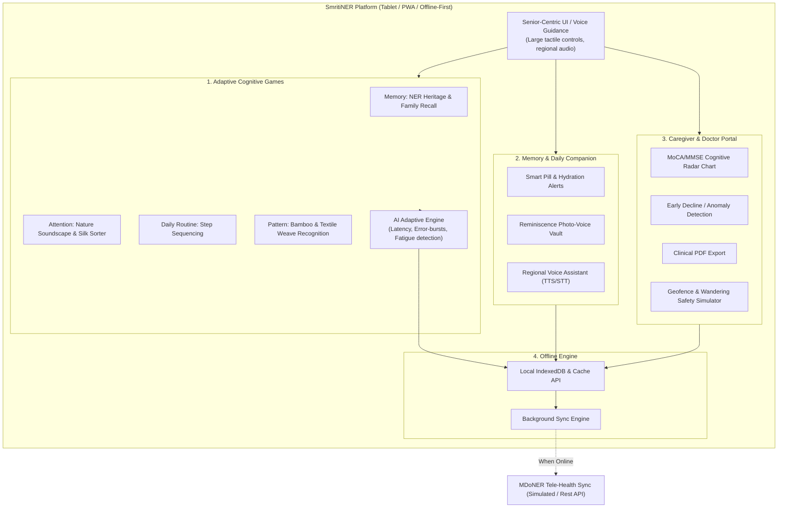

# SmritiNER (স্মৃতি-উত্তৰ-পূব)
### AI-Based Cognitive Gaming and Memory Assistance Platform for Elderly Dementia Patients in the North Eastern Region (NER)
**Smart India Hackathon (SIH 2026) • Problem Statement ID: SIH26003**  
**Organization:** Ministry of Development of North Eastern Region (MDoNER)  
**Theme:** MedTech / HealthTech / Software

---

## 🌟 Executive Summary
**SmritiNER** is a culturally tailored, tablet-first, offline-ready digital rehabilitation and memory assistance platform designed to combat the rising burden of Mild Cognitive Impairment (MCI) and Alzheimer's dementia among elderly populations across the 8 North Eastern states of India. 

The platform bridges geographical and medical barriers in remote hilly terrains by combining:
1. **Culturally Grounded Cognitive Gaming (4 Domains):** Traditional North Eastern heritage, festivals, nature soundscapes, and handloom textile weaves.
2. **Real-time AI Adaptive Difficulty Engine:** Mathematical evaluation of reaction latency and touch hesitation to auto-calibrate challenges and deploy gentle scaffolding hints.
3. **Regional Multi-lingual Speech Synthesis:** Audio guidance in Assamese (অসমীয়া), Meitei/Manipuri (মৈতৈলোন্), Bengali (বাংলা), Hindi (हिंदी), and English.
4. **Resilient Offline-First Architecture:** Complete offline persistence via IndexedDB and Cache API, ensuring zero downtime in remote valleys without mobile connectivity.
5. **Caregiver & Clinician Safety Hub:** Standardized MoCA/MMSE clinical radar charts, weekly reaction latency tracking, early decline anomaly detection, and a GPS safe-zone wandering simulator.

---

## 📐 System Architecture & Flowchart



---

## 🎮 The 4 Cognitive Domains

1. **Memory Recall (NER Cultural Heritage)**:
   - Match and recall traditional cultural assets: Bihu Dhol (Assam), Kaziranga Rhino, Hornbill Headdress (Nagaland), Golden Muga Silk, Living Root Bridges (Meghalaya), Majuli Vaishnavite Masks, and Loktak Sangai Deer (Manipur).
   - Audio reminiscence story narration upon matching.
2. **Attention & Concentration (Nature & Traditional Motif Sorter)**:
   - Spot target cultural symbols and soundscapes amidst visual distractors.
3. **Daily Routine Sequencing (Activities of Daily Living - ADL)**:
   - Chronological step arrangement (Morning Laal Cha $\to$ Prescribed heart pills $\to$ Courtyard garden walk $\to$ Warm herbal bath & evening lamp $\to$ Nourishing lunch).
4. **Visuospatial & Pattern Recognition (Traditional Weave Builder)**:
   - Geometric textile pattern reconstruction inspired by Muga silk chevrons, Naga shawls, and bamboo wicker crafts.

---

## 🤖 Real-Time AI Adaptive Difficulty Engine
The engine continuously samples player telemetry:
- **Touch Reaction Latency ($L_{obs}$):** Time to first interaction.
- **Decision Hesitation:** Inactivity gaps during card selection.
- **Error Burst Rate:** Number of consecutive incorrect trials.

$$\Delta L = \alpha \cdot (\text{Target Latency} - \text{Observed Latency}) + \beta \cdot (\text{Accuracy} - 0.75)$$

- **Auto-Scaffolding:** If hesitation exceeds **6.0 seconds** or 2 consecutive errors occur, the platform gently illuminates matching hints and provides comforting regional spoken clues to eliminate frustration and preserve patient dignity.
- **Cognitive Fatigue Index ($F_{score}$):** If fatigue crosses 75%, it recommends a break in the **Peaceful Sensory Calming Zone** (featuring guided 4-4-4 breathing and procedural bamboo flute melodies synthesized via Web Audio API).

---

## 🛡️ Caregiver & Clinician Features
- **MoCA/MMSE Cognitive Radar Indices:** Tracks Delayed Recall, Attention, Visuospatial orientation, Executive routine, and Temporal orientation.
- **Weekly Reaction Latency Trends:** Historical day-by-day response speed tracking with early decline anomaly detection.
- **GPS Safe-Zone Wandering Simulator:** Configurable 300m geofence with simulated breach alerts to safeguard dementia patients prone to wandering.
- **One-Click Clinical PDF Export:** Generates standardized medical progress summaries for hospital consultations.
- **PIN-Protected Mode Switch:** Default PIN `1234` or `26003` to prevent accidental elderly navigation.

---

## 📊 Presentation Deck (SIH Submission Template)
- **PowerPoint Submission Deck:** [`SIH26003_SmritiNER_Idea_Submission.pptx`](./SIH26003_SmritiNER_Idea_Submission.pptx) (Formatted strictly inside the official SIH 2026 idea template).
- **Slide-by-Slide Markdown:** [`presentation/SIH26003_Presentation_Content.md`](./presentation/SIH26003_Presentation_Content.md).
- **Presentation Generator Script:** [`build_sih_presentation.py`](./build_sih_presentation.py).

---

## 🚀 Quickstart & Local Setup

### Prerequisites
- Node.js (v18+)
- Python 3.10+ (for PPT generation)

### Installation & Run
```bash
# 1. Clone repository
git clone https://github.com/abdu1hafeel/SIH26003_SmritiNER.git
cd SIH26003_SmritiNER

# 2. Install dependencies
npm install

# 3. Start development server
npm run dev
```
Open **`http://localhost:5173/`** in your browser.

---

## 📜 License
Developed for **Smart India Hackathon 2026** (Problem Statement ID: **SIH26003**).
Ministry of Development of North Eastern Region (MDoNER).
