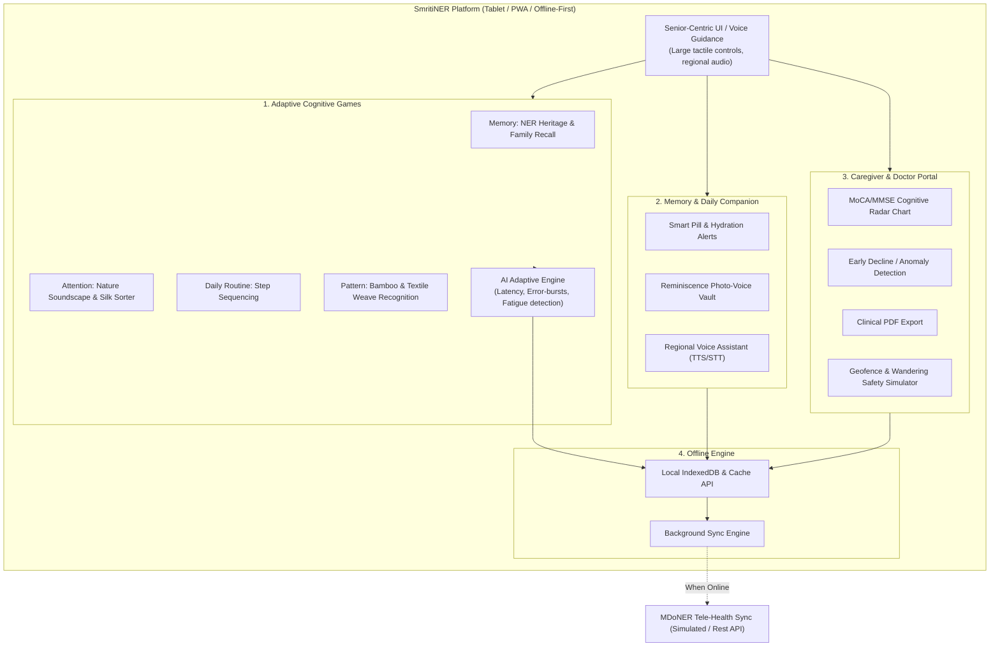

# Smart India Hackathon (SIH 2026) - Presentation Deck
## Problem Statement ID: SIH26003
### Title: AI-Based Cognitive Gaming and Memory Assistance Platform for Elderly Dementia Patients in the North Eastern Region (NER)
### Ministry / Organization: Ministry of Development of North Eastern Region (MDoNER)
### Platform Name: **SmritiNER (স্মৃতি-উত্তৰ-পূব)**

---

## Slide 1: Title & Team Introduction
- **Problem Statement ID:** SIH26003
- **Theme / Category:** HealthTech / MedTech / Software
- **Organization:** Ministry of Development of North Eastern Region (MDoNER)
- **Project Title:** SmritiNER – Culturally Grounded, AI-Adaptive Cognitive Stimulation & Memory Assistance Platform for Elderly Dementia Care in NER
- **Team Name & ID:** [Insert Team Name & ID]
- **Core Value Proposition:** Bridging the geriatric healthcare divide in remote North Eastern valleys through offline-first AI adaptive gaming, regional reminiscence therapy, and caregiver safety intelligence.

---

## Slide 2: Problem Context & The Ground Reality in NER
- **Surging Geriatric Cognitive Burden:** Rising cases of Mild Cognitive Impairment (MCI) and Alzheimer's/dementia across North Eastern states, projected to double over the next decade.
- **Geographic & Infrastructural Isolation:** Hilly terrains, remote villages, and high transport barriers lead to severe scarcity of specialized neurologists and memory care centers outside major hubs like Guwahati and Imphal.
- **Cultural & Linguistic Disconnect in Existing Apps:** Global or mainstream apps use Western/urban concepts that feel alien and confusing to elderly patients in Assam, Manipur, Meghalaya, Mizoram, Nagaland, Arunachal Pradesh, Tripura, and Sikkim.
- **Connectivity Bottlenecks:** Spotty mobile networks and frequent internet downtime render cloud-only solutions ineffective in rural hills.
- **Dementia Wandering & Caregiver Burnout:** Family caregivers lack continuous objective telemetry on cognitive progression and worry about wandering in hazardous terrains.

---

## Slide 3: Proposed Solution – SmritiNER
**SmritiNER** is a tablet-first, offline-ready cognitive rehabilitation and memory companion specifically engineered for the socio-cultural fabric of North East India:

1. **4 Culturally Resonant Cognitive Game Domains:**
   - *Memory Recall:* Traditional festivals (Bihu, Hornbill, Losar), landmarks (Kaziranga, Majuli, Loktak), and native crafts (Muga & Eri silk).
   - *Attention & Concentration:* Nature soundscapes and traditional motif sorting.
   - *Daily Routine Sequencing:* Step-by-step sequencing of daily tasks (Morning tea/Laal cha, morning pills, courtyard walk).
   - *Visuospatial & Patterns:* Geometric weave reconstruction from traditional handlooms.
2. **Dynamic AI Adaptive Difficulty Engine:**
   - Auto-calibrates difficulty in real-time based on touch reaction latency, decision hesitation, and error streaks.
   - Scaffolding mode: Gently offers spoken voice clues and visual hints to prevent agitation and preserve patient dignity.
3. **Regional Multi-lingual Voice Assistant:**
   - Native audio prompts and voice notes in Assamese (অসমীয়া), Meitei/Manipuri (মৈতৈলোন্), Bengali (বাংলা), Hindi (हिंदी), and English.
4. **Offline-First Resilience:**
   - 100% functional without internet via IndexedDB/LocalStorage, queuing data for background sync when connected.
5. **Caregiver & Clinician Telemetry Hub:**
   - MoCA/MMSE aligned radar indices, weekly reaction latency tracking, early decline anomaly detection, and GPS geofence wandering safety alerts.

---

## Slide 4: System Architecture & Technical Flowchart

### Key Technical Architecture Highlights:
- **Client Tier:** React 18, Vite, Tailwind CSS with WCAG AAA senior contrast tokens and dynamic font scaling.
- **Audio & Sensory Tier:** Web Speech API for regional spoken guidance + Web Audio API procedural synthesis for relaxing folk bamboo flute melodies (no audio files needed, zero bandwidth).
- **Adaptive Engine:** Client-side mathematical optimization calculating real-time cognitive latency ($L_{obs}$) and Cognitive Fatigue Index ($F_{score}$).
- **Data Persistence:** Local IndexedDB + Cache API with background queueing.

---

## Slide 5: Innovation & Eliminating AI Slop
Why SmritiNER is genuinely different from generic hackathon projects:
- **No Generic Buzzwords, Real Clinical Rigor:** Maps directly to MoCA (Montreal Cognitive Assessment) domains: Executive Function, Memory Recall, Attention, and Visuospatial orientation.
- **True North Eastern Cultural Grounding:** Uses authentic motifs (Bihu Dhol, Kaziranga Rhino, Hornbill headdress, Muga loom, Majuli masks, Loktak Sangai deer) and soothing tea-garden aesthetics.
- **Non-Pharmacological Agitation Calming:** Built-in "Peaceful Hills" sensory zone providing guided 4-4-4 breathing and binaural flute melodies to soothe dementia "sundowning" agitation.
- **Adaptive Scaffolding, Not Stressful Testing:** Unlike traditional tests that cause anxiety, SmritiNER senses hesitation (>6s) and provides audio encouragement, maintaining patient morale.
- **GPS Safe-Zone Wandering Simulator:** Proactive dementia wandering prevention tailored to riverfront and hilly areas.

---

## Slide 6: Clinical Feasibility, Accessibility & Security
- **Senior-Friendly WCAG AAA UX:**
  - Giant touch targets (>52px) preventing finger tremor mis-taps.
  - One-tap High Contrast Mode (black & amber/yellow) for cataract / low-vision elderly.
  - Multi-lingual text & speech in Assamese, Meitei, Bengali, Hindi, and English.
- **PIN-Protected Caregiver Mode:**
  - Prevents elderly patients from accidentally modifying medications, deleting photos, or leaving the safe app boundary.
- **One-Click Clinical Progress Export:**
  - Generates standardized medical progress reports with reaction latency graphs, medication adherence logs, and clinician notes for hospital consultations.

---

## Slide 7: Scalability, MDoNER Alignment & Roadmap
- **Phase 1 (Month 0-3 - Hackathon Prototype):** Core tablet app with 4 cognitive domains, offline IndexedDB engine, and caregiver portal tested with regional caregivers.
- **Phase 2 (Month 3-6 - MDoNER Community Pilot):** Pilot deployment across Community Health Centers (CHCs) and Old Age Homes in Kamrup Metro (Assam), Imphal West (Manipur), and East Khasi Hills (Meghalaya).
- **Phase 3 (Month 6-12 - Tele-Health Integration):** Direct integration with Ayushman Bharat Digital Mission (ABDM) and MDoNER tele-consultation portals for remote specialist reviews.
- **Social Impact:** Affordable, dignified cognitive longevity for thousands of elderly citizens in North East India, preserving indigenous cultural reminiscence.
